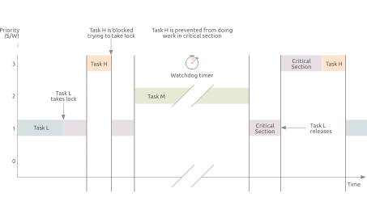
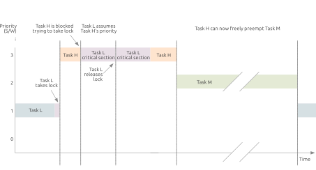

Priority inversion and inheritance
==================================

When a high-priority task is delayed by a low-priority task due to competition for a shared resource, an intermediate-priority task might complete its execution before the high-priority task can proceed.
This situation is referred to as priority inversion and can be resolved using priority inheritance.

The following sections introduce priority inversion and the need for priority inheritance.

Priority inversion
----------------------------

Let's begin with priority inversion by looking at the diagram below.
Three tasks, L, M, and H, with varying priority levels, low, medium and high, are present in the kernel and about to contest for CPU access.

The low-priority task L runs until it takes a lock.
After acquiring it, task L holds the lock and begins modifying some critical sections within the kernel. 
Once the higher-priority task H appears, it preempts task L and starts to run.
At this point, task H would like to acquire the same lock task L is holding.
As it can't do so, the higher-priority task H goes to sleep and waits for the lower-priority task L to release the lock.
Task L thus continues running while Task H is sleeping.
In such a setup, priority inversion can occur if a medium-priority task M comes along and preempts task L.
Once task M starts running, the high-priority task H will potentially wait for an unbounded amount of time, preventing it from doing work in a critical kernel section.
Improving the flexibility to preempt tasks executing within the kernel would thus help guarantee an upper time boundary.

    Unbounded priority inversion: A high-priority task being indefinitely delayed by a medium-priority task due to a lack of proper priority management.

In this specific example, task M finishes running and releases the CPU -- where the horizontal bar turns from green to red in the drawing -- allowing task L to start running again while still holding the lock.
Only once task L releases it, task H will wake up and acquire the lock, starting its work within the critical section.

Priority inversion occurred on the Mars Rover, and it is a critical challenge for developers and engineers working with real-time systems. With unbounded priority inversion, the need for priority inheritance becomes clear.

Priority Inheritance
--------------------

A real-time Linux kernel resolves the unbounded latencies of priority inversion via priority inheritance. 

The diagram below helps illustrate the mechanism.
As before, the low-priority task L starts running and acquires the lock.
Similarly to the previous scenario, task H wakes up and starts running, but it is soon blocked while attempting to get the lock.

The high-priority task H wants to take the same lock held by the low-priority task L.
Differently than in the priority inversion's case, and instead of H going to sleep and waiting, priority inheritance occurs, with L acquiring H's priority.
The low-priority task L can now run with the same priority as task H, enabling it to finish its work in the critical section and then release the lock.
The inheritance mechanism centers around boosting the lower task's priority, giving it one higher than the upcoming medium priority task M, which would cause unbounded latencies.

Once task L finishes its critical section work, task H acquires the lock, where the red bar turns orange.
Whenever task H completes, it will, in turn, release the lock.
Only now can the medium-priority task M come along and start running.
If needed, the higher-priority task H could further preempt task M to finish its processing.
Priority inheritance in a real-time kernel solves the issue of task M starting to run between tasks H and L, which would give rise to unbounded latencies and priority inversion.

    Priority inheritance: A low-priority task temporarily inherits the higher priority of a waiting task to complete its work in a critical section of the kernel and release the resource needed by the high-priority task.

References
----------

- `Introduction to RTOS - Solution to Part 11 (Priority Inversion) <https://www.digikey.com/en/maker/projects/introduction-to-rtos-solution-to-part-11-priority-inversion/abf4b8f7cd4a4c70bece35678d178321>`_
- `Priority inversion - priority inheritance <https://wiki.linuxfoundation.org/realtime/documentation/technical_basics/pi>`_
