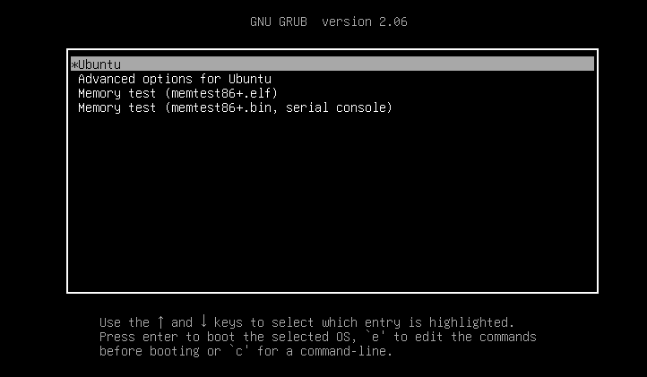
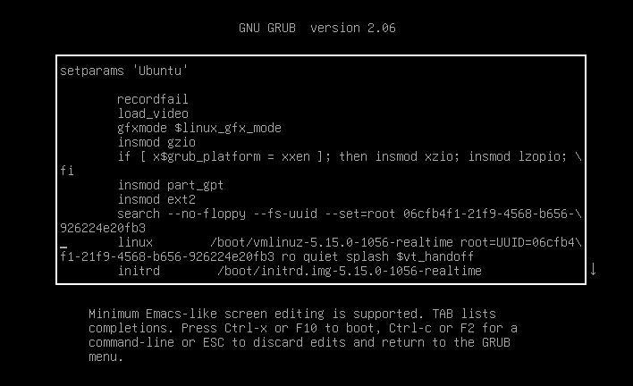

:orphan:
:nosearch:

How to configure CPUs for real-time processing
==============================================

.. warning::
   Deprecated document.

   Refer to:
   
   * `How to modify kernel boot parameters <../modify-kernel-boot-parameters>`_
   * `Kernel boot parameters <../../reference/kernel-boot-parameters>`_

This is a guide to configuring CPUs for real-time processing, by passing
startup commands to `Real-time Ubuntu`_.

Performance-tuning features are compiled into the kernel; they can be
controlled by various means. The approach you'll use here is a common one:
passing in command lines via a bootloader.

Prerequisites
-------------

You'll need Real-time Ubuntu. A native installation is preferred: observations of
real-time performance on a virtual machine can be misleading. To install
Real-time Ubuntu, :doc:`enable-real-time-ubuntu` is recommended reading.

Use a multi-core processor. Examples here were written for, and tested on,
12-core x86-64 (amd64) hardware. 

Your system will need a bootloader that can pass command lines --- GRUB is
assumed. (Some computers can be configured to launch a kernel directly from
firmware instead. That's rare and it doesn't support passing command lines.)

Administrator ("root") privileges are required.

.. caution:: Proceed at your own risk!

   You should be familiar with your bootloader --- in particular with accessing
   its menu during startup, updating its configuration, and recovering an
   unbootable machine if necessary. Experiment on an isolated system if
   possible. Back up important settings, software and data before continuing.

Configuring bootloader parameters
---------------------------------

You can temporarily or permanently configure parameters which GRUB will pass to
Real-time Ubuntu.

When first testing a real-time tuning feature, `configure it temporarily
<#configure-grub- temporarily>`_. Temporary bootloader parameters are passed to
the kernel on a single startup. To re-use them you'll need to re-enter them ---
they don't persist across reboots.

When you're satisfied that a parameter achieves what you want, you can make it
permanent by `updating GRUB's configuration <#configure-grub-permanently>`_
then rebooting.

Configure GRUB temporarily
~~~~~~~~~~~~~~~~~~~~~~~~~~

Reboot, and interrupt GRUB's startup sequence at its bootloader menu.

Highlight the entry --- usually **Ubuntu** --- that would boot Real-time
Ubuntu.

Press **e** to edit its boot parameters.

Append parameters to the line that starts with ``linux``:

* Leave a space before each new parameter

* Don't add space on either side of ``=`` or other punctuation.

Press :kbd:`Ctrl+X` to exit the editor and continue booting with the new
parameters.

Configure GRUB permanently
~~~~~~~~~~~~~~~~~~~~~~~~~~

Once your device has booted, launch a terminal and edit GRUB's configuration:

.. code-block:: shell

   sudo nano /etc/default/grub

Append parameters to the line that starts with ``GRUB_CMDLINE_LINUX_DEFAULT``:

* Enter parameters *inside* the double-quotes

* Leave a space after each new parameter

* Don't add space on either side of ``=`` or other punctuation.

Press :kbd:`Ctrl+X` then :kbd:`Y` to save and close the editor.

Update GRUB with its new configuration:

.. code-block:: shell

   sudo update-grub

Reboot.

CPU lists
~~~~~~~~~

Several parameters require a `CPU list`_ --- a list of CPU numbers, starting from
``0`` and extending no higher than the number of CPUs. 
You can use ``N`` as shorthand for the number of CPUs.

A CPU list must contain no spaces. The CPU numbers it specifies must be in
strictly ascending order. Use a comma to separate individual numbers, with no
space on either side.

Ranges
^^^^^^

You may include ranges in a CPU list, to avoid specifying every CPU by its
number.

A simple range starts with a CPU number and ends with a higher one. Use a
hyphen (``-``) to separate the numbers, with no space on either side; for
example: 

``1-4``

Within a range, you can specify equal-size subranges ("groups"). This is best
illustrated by example. The range ``100-200:3/25`` starts at CPU 100 and ends
at CPU 2000. Within the range, the first three CPUs are specified from
consecutive groups of 25; it's equivalent to:

``100-102,125-127,150-152,175-177``

Like individual CPU numbers, a range must be separated from its neighbors by a
comma with no space on either side.

Valid examples:

* ``0,1,2``

* ``0-2``

* ``1-3,5,7-11``

Non-compliant examples:

* ``0,2,1`` (not strictly ascending)

* ``0,1-3,3-6`` (not strictly ascending)

* ``1-8`` (invalid in, say, an eight-CPU system, whose highest CPU number
  should be '7')

Real-time tuning parameters
---------------------------

Tune the performance of Real-time Ubuntu, by adding parameters from this
section to your bootloader configuration.

Reduce scheduler jitter
~~~~~~~~~~~~~~~~~~~~~~~

Real-time Ubuntu is compiled with the ``CONFIG_NO_HZ_FULL=y`` kernel
configuration option. This "`NO_HZ`_" facility can reduce jitter, by vetoing
unnecessary scheduling-clock interrupts. (You can assist it by also `offloading
read-copy-update <#reduce-read-copy-update-jitter>`_ tasks.)

Tickless CPUs
^^^^^^^^^^^^^

An idle CPU has no tasks and therefore no scheduling requirement. When you
enable NO_HZ *without* isolating any CPUs, idle ones will receive no scheduler
ticks. They're then "tickless" (or "dyntick-idle"). To prevent scheduler ticks
for tickless CPUs, configure the ``nohz`` kernel command-line parameter:

``nohz=on``

Adaptive-tick CPUs
^^^^^^^^^^^^^^^^^^

Scheduler ticks are also pointless for a CPU with only one task: it has no
other tasks for a scheduler to switch to. Isolate such "adaptive-ticks CPUs",
to veto scheduler ticks for them (and, at the same time, for tickless CPUs)
configure the following kernel command-line parameters:
    
``nohz=on nohz_full=<CPU list>``

where <CPU list> specifies the CPUs to be isolated. The list must not include
the CPU that boots the system, meaning the ones you want to avoid receiving
scheduling-clock interrupts.

Reduce read-copy-update jitter
~~~~~~~~~~~~~~~~~~~~~~~~~~~~~~

Callbacks for Linux's read-copy-update (RCU) mechanism are assigned to
candidate CPUs. By removing a CPU from the candidate list you can reduce jitter
in its remaining tasks. To allow that, Real-time Ubuntu is compiled with the
``CONFIG_RCU_NOCB_CPU=y`` kernel configuration option.

To offload RCU callbacks from specified CPUs, use the kernel command-line
parameter:
    
``rcu_nocbs=<CPU list>``

When RCU callbacks are offloaded from a CPU, it has more opportunity to enter
dyntick-idle or adaptive-tick mode. That helps the NO_HZ facility to
`reduce scheduler jitter <#reduce-scheduler-jitter>`_.

Offloaded RCU callbacks
^^^^^^^^^^^^^^^^^^^^^^^

Offloaded RCU callbacks must still be processed somehow. For real-time
performance, housekeeping CPUs make good candidates because they can tolerate
jitter. You should specify candidate CPUs for RCU callbacks, otherwise the
scheduler will make an assignment which may not suit your preference.

You can't do that using bootloader parameters; instead use the userspace
:command:`tuna` tool at runtime. For example, to assign all RCU callback
threads to housekeeping CPU 0:

.. code-block:: shell

   sudo tuna -t rcu* -c 0 -m

Each offloaded callback thread must be woken up somehow, which introduces
jitter if it's done by a candidate CPU. If you've assigned a housekeeping CPU,
that may not matter; if it does, instead you can wake up RCU threads with a
timer, set the following boot parameter:

``rcu_nocb_poll``

Isolate CPUs from SMP algorithms
--------------------------------

Jitter can affect tasks assigned by the symmetric multiprocessing (SMP)
balancing and scheduling algorithms. You can isolate CPUs, so tasks won't be
assigned to them by those algorithms.

To isolate CPUs from the general SMP scheduler, use the kernel command-line
parameter:

``isolcpus=<CPU list>``

Having isolated a CPU, at runtime you can assign real-time tasks to it
explicitly using CPU affinity or CPU sets.

This facility combines well with protecting CPUs from having to `service
interrupt requests <#exclude-cpus-from-irq-handling>`_ (IRQs). An isolated CPU
without IRQ-handling duties can be assigned real-time tasks that demand minimal
jitter.

Exclude CPUs from IRQ handling
------------------------------

By default, the SMP algorithms may assign any CPU to service any IRQ. You can
change that default (provided the IRQ controller supports IRQ affinity --- most
controllers do). Protecting a CPU from having to service IRQs can remove
significant jitter from its remaining tasks.

Change the default IRQ-affinity list, to restrict which CPUs are available for
servicing interrupts, use the kernel command-line parameter:

``irqaffinity=<CPU list>``

The list must not be empty --- IRQs have to be serviced somehow.

Having ring-fenced a CPU from IRQ-handling duties, at runtime you can assign
real-time tasks to it explicitly using CPU affinity or CPU sets.

This facility combines well with `isolating CPUs
<#isolate-cpus-from-smp-algorithms>`_ from SMP algorithms. An isolated CPU
without IRQ-handling duties can be assigned real-time tasks that demand minimal
jitter.

The following example would isolate CPUs 3-5 from the SMP algorithms, and
protect them from having to service IRQs. At runtime, they could be assigned
to real-time tasks demanding minimal jitter:

``isolcpus=3-5 irqaffinity=0-2,6-N``

.. note::

   You can't protect a CPU from all IRQ-handling duties. It may still have to
   service a small number of "soft IRQs".

.. LINKS
.. _Real-time Ubuntu: https://ubuntu.com/real-time
.. _NO_HZ: https://docs.kernel.org/timers/no_hz.html
.. _CPU list: https://www.kernel.org/doc/html/v5.15/admin-guide/kernel-parameters.html#cpu-lists
