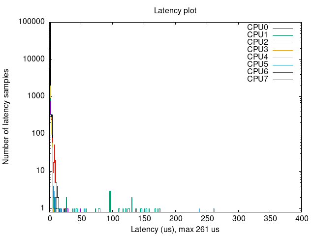

How to measure maximum latency in a real-time system 
====================================================

On `real-time`_ systems one of the most important metrics is the maximum latency. 
This is the maximum time it takes for a system to respond to an event. It's 
important because it can be used to determine if a system is capable of 
responding to an event in a timely manner. In other words, it can be used to
determine whether a system can meet the required deadlines.

The key tool here will be the `cyclictest`_ tool.

Install
--------

``cyclictest`` is part of the `rt-tests`_ package, which is a collection of 
programs for testing the real-time capabilities of a Linux system. Install it:

.. code-block:: bash

    sudo apt install rt-tests

Usage
------

``cyclictest`` must be run as root, with sudo, or as a member of the realtime 
group. Get the maximum latency of the system by running:

.. code-block:: console 
    
    $ sudo cyclictest --mlockall --smp --priority=80 --interval=200 --distance=0

.. tabs::

    
    .. tab:: without real-time kernel

        .. code-block:: console

            T: 0 (18738) P:80 I:200 C: 100000 Min:    1 Act:    1 Avg:    1 Max:     564
            T: 1 (18739) P:80 I:200 C:  99993 Min:    1 Act:    1 Avg:    1 Max:      79
            T: 2 (18740) P:80 I:200 C:  99986 Min:    1 Act:    2 Avg:    1 Max:     110
            T: 3 (18741) P:80 I:200 C:  99979 Min:    1 Act:    2 Avg:    1 Max:      18
            T: 4 (18742) P:80 I:200 C:  99973 Min:    1 Act:    2 Avg:    1 Max:       9
            T: 5 (18743) P:80 I:200 C:  99966 Min:    1 Act:    2 Avg:    1 Max:       9
            T: 6 (18744) P:80 I:200 C:  99939 Min:    1 Act:    2 Avg:    1 Max:      39
            T: 7 (18745) P:80 I:200 C:  99953 Min:    1 Act:    2 Avg:    1 Max:      92
            T: 8 (18746) P:80 I:200 C:  99945 Min:    1 Act:    2 Avg:    2 Max:     573
            T: 9 (18747) P:80 I:200 C:  99941 Min:    1 Act:    2 Avg:    1 Max:      48
            T:10 (18748) P:80 I:200 C:  99935 Min:    1 Act:    2 Avg:    1 Max:       9
            T:11 (18749) P:80 I:200 C:  99929 Min:    1 Act:    2 Avg:    1 Max:      39
            T:12 (18750) P:80 I:200 C:  99922 Min:    1 Act:    2 Avg:    1 Max:       9
            T:13 (18751) P:80 I:200 C:  99916 Min:    1 Act:    2 Avg:    1 Max:       9
            T:14 (18752) P:80 I:200 C:  99910 Min:    1 Act:    2 Avg:    1 Max:       9
            T:15 (18753) P:80 I:200 C:  99902 Min:    1 Act:    2 Avg:    1 Max:       9

    .. tab:: with real-time kernel

        .. code-block:: console

            T: 0 ( 1469) P:80 I:200 C: 100000 Min:    2 Act:    2 Avg:    2 Max:      10
            T: 1 ( 1470) P:80 I:200 C: 100000 Min:    1 Act:    2 Avg:    2 Max:      10
            T: 2 ( 1471) P:80 I:200 C: 100000 Min:    2 Act:    2 Avg:    2 Max:      10
            T: 3 ( 1472) P:80 I:200 C: 100000 Min:    2 Act:    2 Avg:    2 Max:       9
            T: 4 ( 1473) P:80 I:200 C: 100000 Min:    1 Act:    2 Avg:    2 Max:       9
            T: 5 ( 1474) P:80 I:200 C:  99994 Min:    2 Act:    2 Avg:    2 Max:      10
            T: 6 ( 1475) P:80 I:200 C:  99983 Min:    2 Act:    2 Avg:    2 Max:      10
            T: 7 ( 1476) P:80 I:200 C:  99971 Min:    2 Act:    2 Avg:    2 Max:      10
            T: 8 ( 1477) P:80 I:200 C:  99960 Min:    2 Act:    2 Avg:    2 Max:       9
            T: 9 ( 1478) P:80 I:200 C:  99949 Min:    1 Act:    2 Avg:    2 Max:       9
            T:10 ( 1479) P:80 I:200 C:  99938 Min:    2 Act:    2 Avg:    2 Max:      10
            T:11 ( 1480) P:80 I:200 C:  99926 Min:    2 Act:    2 Avg:    2 Max:      10
            T:12 ( 1481) P:80 I:200 C:  99915 Min:    1 Act:    2 Avg:    2 Max:       9
            T:13 ( 1482) P:80 I:200 C:  99904 Min:    2 Act:    2 Avg:    2 Max:      10
            T:14 ( 1483) P:80 I:200 C:  99892 Min:    2 Act:    2 Avg:    2 Max:      10
            T:15 ( 1484) P:80 I:200 C:  99881 Min:    2 Act:    2 Avg:    2 Max:      10

.. NOTE: Using outputs of the test: https://warthogs.atlassian.net/browse/IENG-907?focusedCommentId=365824
.. To be changed later to have consistent results and histogram plot

The **maximum latency** is indicated by the **Max** value in the output, per CPU core. When using the real-time kernel on the same machine, the maximum latencie becomes remarkbly smaller and more deterministic. 

By default the last command runs until it receives a SIGINT signal (Ctrl+C), or 
other signal that stops the process. To limit the number of iterations use the 
``--loops=`` (or ``-l``) option:

.. code-block:: console
    
    $ sudo cyclictest --mlockall --smp --priority=80 --interval=200 --distance=0 --loops=100000

This will run the test 100000 times.

Sometimes to have a comparison between different runs, it is useful to use the
``--duration=`` (or ``-D``) option appending 'm', 'h', or 'd' to specify 
minutes, hours or days.

.. code-block:: console
    
    $ sudo cyclictest --mlockall --smp --priority=80 --interval=200 --distance=0 --duration=10m

This will run the test for 10 minutes.

The results are in microseconds(us) by default, but you can change it to nanoseconds 
with the ``--nsecs`` (or ``-N``) option:

.. code-block:: console
    
    $ sudo cyclictest --mlockall --smp --priority=80 --interval=200 --distance=0 --nsecs

As described on this `OSAL`_ page, `cyclictest`  can also output a histogram of 
the latencies using the ``--histogram`` (or ``-h``) option, which we can plot 
with `gnuplot` after some transformation.

Install the `gnuplot`_ package:

.. code-block:: bash

    sudo apt install gnuplot

Then, download the `histogram-plot.sh`_ script, make it executable and run it:

.. code-block:: bash

    sudo ./histogram-plot.sh

This script executes the ``cyclictest`` with some specific parameters, like 
``-h400`` (for the histogram) and ``-l100000``, then uses `gnuplot` to plot the 
histogram. The resulted histogram will be saved in the file ``plot.png``.

The resulting image should look like this:

.. note:: 
    To get more accurate results on latency measurements, it is recommended to
    run the test on a system with the same or very similar load that is expected in production.
    This could be done by using `stress-ng`_, so first, install it:

    .. code-block:: bash

        sudo apt install stress-ng

    Then run it with the desired parameters. For example:

    .. code-block:: bash

        sudo stress-ng --cyclic 1 --cyclic-dist 250 --cyclic-method clock_ns --cyclic-policy rr -t 3600 --log-file cyclic-stress.log --verbose
    
    Note that the above command will run the stress-ng for 1 hour, and will log
    the results in the file ``cyclic-stress.log``. The ``--cyclic-dist`` option
    specifies the distribution of the sleep times, and the ``--cyclic-method``
    option specifies the method to use for the cyclic stress. The ``--cyclic-policy``
    option specifies the scheduling policy to use for the cyclic stress.
    Note that this options are just an example, and can be changed to fit the
    specific needs of each system.

.. Links
.. _real-time: https://ubuntu.com/real-time
.. _cyclictest: https://wiki.linuxfoundation.org/realtime/documentation/howto/tools/cyclictest/start
.. _rt-tests: https://wiki.linuxfoundation.org/realtime/documentation/howto/tools/rt-tests
.. _OSAL: https://www.osadl.org/Create-a-latency-plot-from-cyclictest-hi.bash-script-for-latency-plot.0.html
.. _gnuplot: http://www.gnuplot.vt.edu/
.. _histogram-plot.sh: histogram-plot.sh
.. _stress-ng: https://manpages.ubuntu.com/manpages/jammy/man1/stress-ng.1.html

.. The lantency test was performed on the following machine:
.. queue 202102-28727: 
.. description:
.. HP Z2 SFF G8 Workstation - Saturn, Intel i9-11900 CPU, Intel 8086:43f0 WiFi

.. The histogram was generated based on testflinger machine: 202106-29207
.. queue description: 
.. HP EliteBook 830 G8 Notebook PC (64 GB) - Corvette13, Core i7-1185G7 CPU, Intel 8086:a0f0 WiFi
.. Characteristics: 
..          CPU: Core i7-1185G7  
..          RAM: 64GB
..          OS: Ubuntu 22.04.4 LTS
..          Kernel: 6.5.0-21-generic #21~22.04.1-Ubuntu SMP PREEMPT_DYNAMIC Fri Feb  9 13:32:52 UTC 2 x86_64 GNU/Linux

.. Latter the results will be unified and tested in only one machine