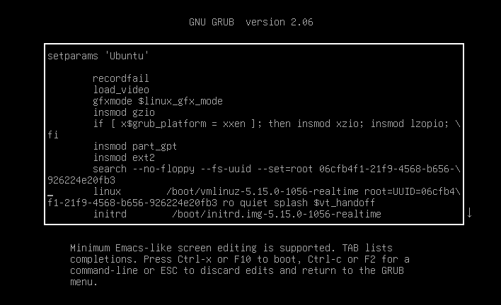

.. meta::
   :description: Learn how to modify Real-time Ubuntu kernel boot parameters, including on Raspberry Pi and Ubuntu Core, to test, debug and deploy real-time applications.

How to modify kernel boot parameters
====================================

The real-time performance-tuning features compiled into the kernel can be
controlled by various means. The approach used here is a common one:
passing command line parameters via a bootloader.

The Linux kernel supports a wide range of parameters, but only a few of them are relevant to real-time tuning.
:doc:`/reference/kernel-boot-parameters` is good a reference.

Depending on the underlying boot mechanism, there are multiple ways to pass command line parameters to the kernel:

* For Raspberry Pi, jump to :ref:`raspberry-pi`.
* Ubuntu Core uses GRUB but provides a different interface for modifying kernel boot parameters; scroll down to :ref:`ubuntu-core-kernel-cmdline`.
* Continue reading for systems that use the :ref:`GNU GRUB bootloader <grub-bootloader>`.

.. _grub-bootloader:

Modify kernel boot parameters via GRUB
--------------------------------------

You can temporarily or permanently configure parameters which GRUB will pass to
Real-time Ubuntu.

When first testing a real-time tuning feature, `configure it temporarily
<#configure-grub-temporarily>`_. Temporary bootloader parameters are passed to
the kernel on a single startup. To re-use them you'll need to re-enter them ---
they don't persist across reboots.

When you're satisfied that a parameter achieves what you want, you can make it
permanent by `updating GRUB's configuration <#configure-grub-permanently>`_
then rebooting.

Configure GRUB temporarily
~~~~~~~~~~~~~~~~~~~~~~~~~~

Reboot, and interrupt GRUB's startup sequence at its bootloader menu.

Highlight the entry --- usually **Ubuntu** --- that would boot Real-time
Ubuntu.

.. image:: grub-menu.png
   :alt: GRUB menu
   :width: 100%
   :align: center

Press :kbd:`e` to edit its boot parameters.

Append parameters to the line that starts with ``linux``:

* Leave a space before each new parameter
* Don't add space round ``=`` and other punctuations for each key-value
* Don't add line breaks

For example, after adding ``nohz=on`` and ``nohz_full=1-3``:

.. code-block:: text

           linux        /boot/vmlinuz-5.15.0-1056-realtime root=UUID=06cfb4f1-21f9-4568-b656-926224e20fb3 ro quiet splash $vt_handoff nohz=on nohz_full=1-3

Press :kbd:`Ctrl+X` to exit the editor and continue booting with the new
parameters.

Configure GRUB permanently
~~~~~~~~~~~~~~~~~~~~~~~~~~

Once your device has booted, use a text editor to open ``/etc/default/grub``.

Add parameters to ``GRUB_CMDLINE_LINUX``:

* Enter parameters *inside* the double-quotes
* Leave a space before each new parameter
* Don't add space round ``=`` and other punctuations for each key-value
* Don't add line breaks

For example, after adding ``nohz=on`` and ``nohz_full=1-3``:

.. code-block:: ini

   GRUB_CMDLINE_LINUX="nohz=on nohz_full=1-3"

Save and close the editor.

Update GRUB with its new configuration:

.. code-block:: shell

   sudo update-grub

Reboot.

.. _raspberry-pi:

Modify kernel boot parameters on Raspberry Pi
---------------------------------------------

On a Raspberry Pi running Ubuntu Server / Desktop, the kernel command line arguments are found under
`/boot/firmware/cmdline.txt`_.

For example, on Ubuntu 24.04 with the real-time kernel:

.. code-block:: shell-session

   $ cat /boot/firmware/cmdline.txt 
   console=serial0,115200 multipath=off dwc_otg.lpm_enable=0 console=tty1 root=LABEL=writable rootfstype=ext4 rootwait fixrtc

Use a text editor to edit this file ``/boot/firmware/cmdline.txt``.

Append parameters to the line:

* Leave a space after each new parameter
* Don't add space round ``=`` and other punctuations for each key-value
* Don't add line breaks

For example, after adding ``nohz=on`` and ``nohz_full=1-3`` to the above example:

.. code-block:: shell-session

   $ cat /boot/firmware/cmdline.txt
   console=serial0,115200 multipath=off dwc_otg.lpm_enable=0 console=tty1 root=LABEL=writable rootfstype=ext4 rootwait fixrtc nohz=on nohz_full=1-3

Save and close the editor.

Reboot.

Verify the parameters passed to the kernel at boot time:

.. code-block:: shell-session

   $ cat /proc/cmdline
   reboot=w coherent_pool=1M 8250.nr_uarts=1 pci=pcie_bus_safe snd_bcm2835.enable_compat_alsa=0 snd_bcm2835.enable_hdmi=1  smsc95xx.macaddr=D8:3A:DD:E4:0B:D3 vc_mem.mem_base=0x3fc00000 vc_mem.mem_size=0x40000000  console=ttyAMA10,115200 multipath=off dwc_otg.lpm_enable=0 console=tty1 root=LABEL=writable rootfstype=ext4 rootwait fixrtc nohz=on nohz_full=1-3

.. _ubuntu-core-kernel-cmdline:

Modify boot parameters on Ubuntu Core
-------------------------------------

.. note::

    This section assumes access to features currently available exclusively to `dedicated Snap Store`_ users.

Ubuntu Core doesn't have the :code:`/etc/default/grub` file mapped for the kernel parameters, nor the :manpage:`update-grub(8)` utility.
On Ubuntu Core, the kernel parameters can be modified statically or dynamically.
Static configurations are added during the image build.
On the other hand, dynamic configurations are set using `snap options`_ on a running system.

This section focuses on the dynamic method for configuring kernel boot parameters, suitable for iteratively tuning the operating system.

.. hint::
    
    Refer to :doc:`../how-to/uc-image-creation` if you want to create a Real-time Ubuntu Core image.

Open a terminal and access your Real-time Ubuntu Core instance.
The instance should be on a physical device rather than a virtual machine.
While a virtual machine can be used to follow the steps in this guide, it will not provide the benefits of a real-time kernel.

There are two snap options for setting the kernel parameters:

- `system.kernel.cmdline-append`_ - used to append permitted kernel boot parameters that are verified against an `allow list`_ in the `gadget snap`_. 
- `system.kernel.dangerous-cmdline-append`_ - used to append any other kernel boot parameters, considered as not analyzed by the gadget snap.

When using the reference gadget snaps (`pc-gadget`_ and `pi-gadget`_), you need to use the ``system.kernel.dangerous-cmdline-append`` option, as the allow list is not present in them.

When creating a custom `gadget snap`_ for a real-time Ubuntu Core system, it is advisable to add an allow list with the relevant parameters.

The kernel parameters in the snap configurations exactly match the `kernel parameters`_ that would be passed to the kernel on the grub command line, :code:`GRUB_CMDLINE_LINUX_DEFAULT` in :code:`/etc/default/grub` file. 
Parameters are passed as a single string in the :code:`key=value` format, with each parameter separated by a space.

For example, the command below sets ``nohz=on``, ``nohz_full=2-N``, and ``irqaffinity=0-1``:

.. code-block:: bash
    
    snap set system system.kernel.dangerous-cmdline-append="nohz=on nohz_full=2-N irqaffinity=0-1"

After setting the kernel parameters, it's necessary to reboot the system to apply the changes.
Then you can check if the parameters were applied:

.. code-block:: console

    $ cat /proc/cmdline
    snapd_recovery_mode=run console=ttyS0,115200n8 console=tty1 panic=-1 nohz=on nohz_full=2-N irqaffinity=0-1

To undo all the modifications made to the kernel parameters, use the `snap unset`_ command:

.. code-block:: bash

    snap unset system system.kernel.dangerous-cmdline-append

And reboot.

Once you are satisfied with the configurations, consider configuring them statically so that they are built into the image. 
Read more on :doc:`../how-to/uc-image-creation`.

.. LINKS
.. _/boot/firmware/cmdline.txt: https://www.raspberrypi.com/documentation/computers/configuration.html#kernel-command-line-cmdline-txt
.. _Ubuntu Core: https://ubuntu.com/core
.. _snap set: https://ubuntu.com/core/docs/modify-kernel-options
.. _system.kernel.cmdline-append: https://snapcraft.io/docs/system-options#heading--kernel-cmdline-append
.. _system.kernel.dangerous-cmdline-append: https://snapcraft.io/docs/system-options#heading--kernel-dangerous-cmdline-append
.. _gadget snap: https://snapcraft.io/docs/the-gadget-snap
.. _allow list: https://snapcraft.io/docs/the-gadget-snap#heading--dynamic
.. _nohz: https://docs.kernel.org/timers/no_hz.html
.. _nohz_full: https://docs.kernel.org/timers/no_hz.html#omit-scheduling-clock-ticks-for-cpus-with-only-one-runnable-task
.. _kernel parameters: https://docs.kernel.org/admin-guide/kernel-parameters.html
.. _cpu list: https://docs.kernel.org/admin-guide/kernel-parameters.html#cpu-lists
.. _irqaffinity: https://docs.kernel.org/core-api/irq/irq-affinity.html
.. _snap unset: https://snapcraft.io/docs/set-system-options
.. _building a gadget snap: https://ubuntu.com/core/docs/gadget-building
.. _pc-gadget: https://github.com/snapcore/pc-gadget
.. _pi-gadget: https://github.com/snapcore/pi-gadget
.. _snap options: https://snapcraft.io/docs/system-options
.. _dedicated Snap Store: https://ubuntu.com/core/docs/dedicated-snap-stores
